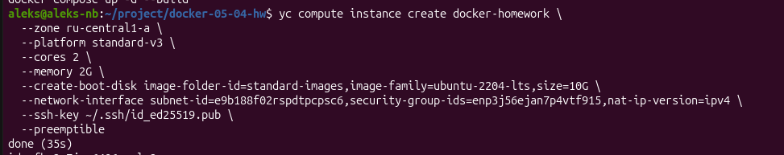
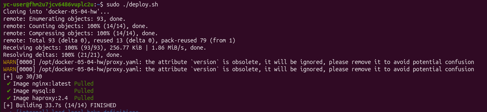
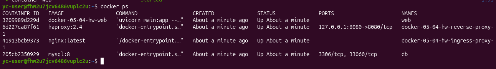
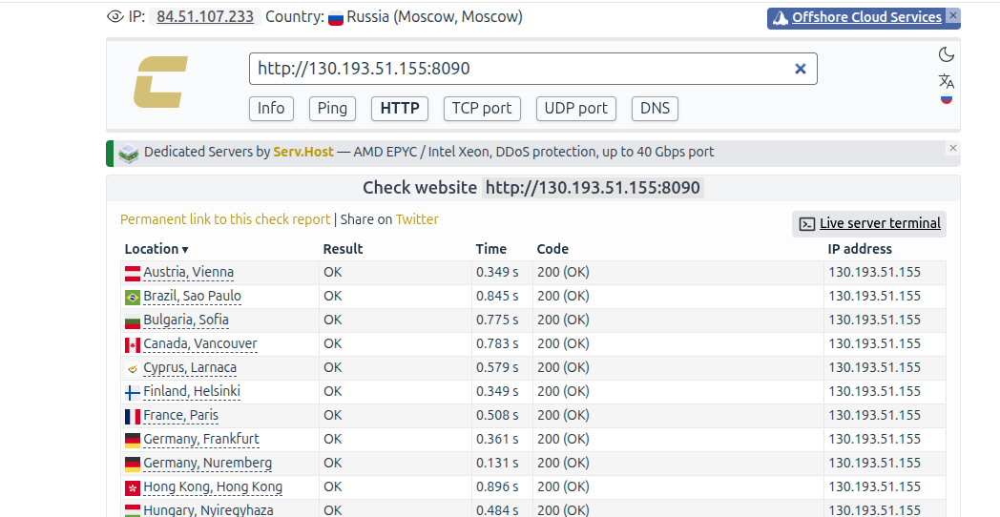
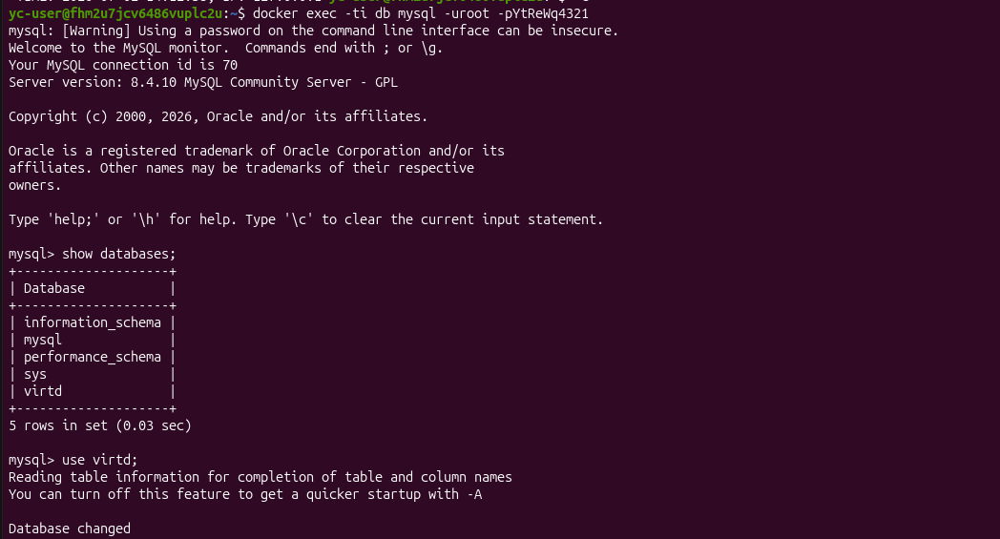
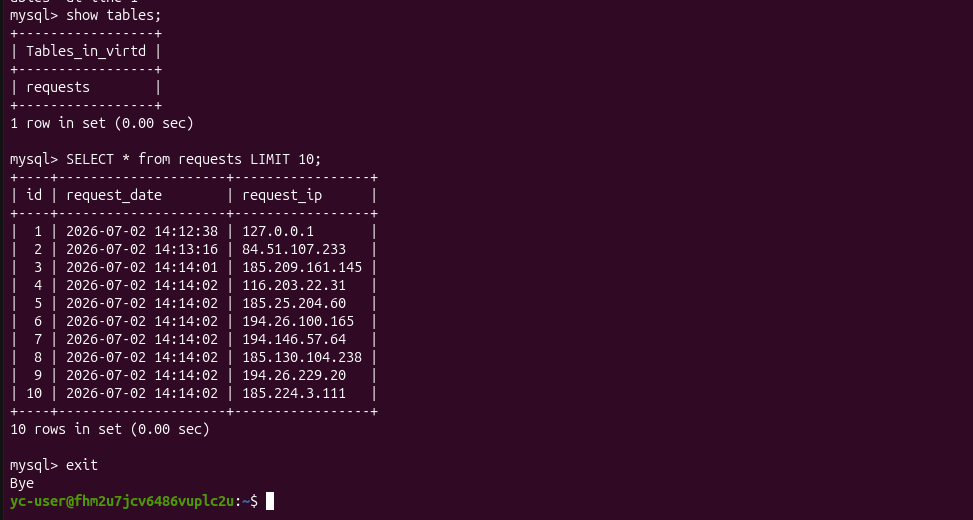
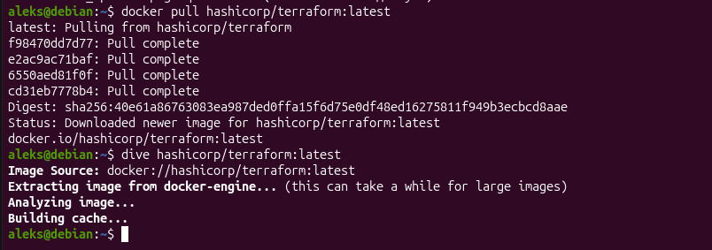
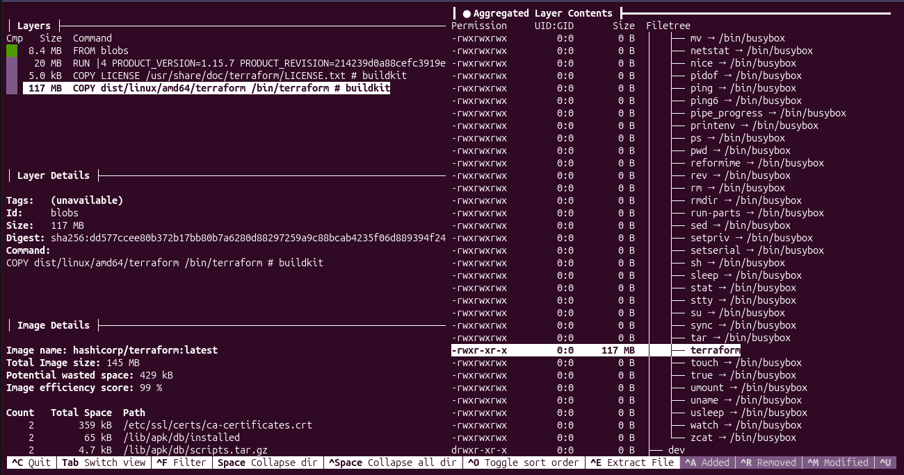
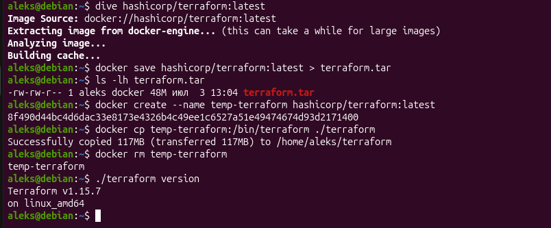

# Домашнее задание к занятию 5. «Практическое применение Docker»

## Задача 0 Убедитесь что у вас НЕ(!) установлен docker-compose

## Задача 1

## Задача 3

## Задача 4

*создаём ВМ*

*запускаем скрипт*

*проверка контейнеров*

*проверка с https://check-host.net/check-http*

*запросы sql*

## Задача 6

*запуск dive*

*слой с terraform*

*извлекаем через docker save*
